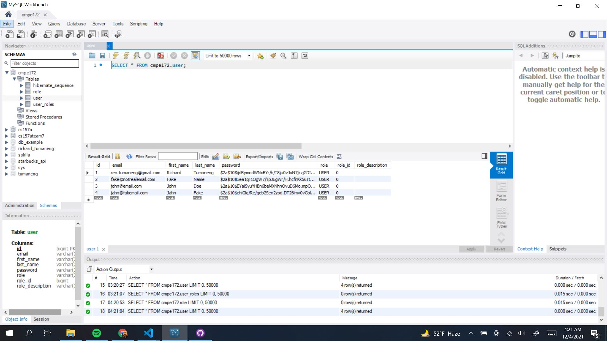

# Richard's Journal

## 11/30/21
* Created Customer model and repository
* Created Employee repository

## 12/2/21
* Created Manga and Genre Models
* Created MySQL connector and swapped from H2 test database to MySQL connector
* 
**The Screenshot above shows the Command Line after registration of a new User**
* 
**The Screenshot above shows MySQL workbench after creation of multiple Users**

## 12/3/21
* Updated Payments model, Repository, Service, and Controller
* Updated User model

## 12/4/21
* Group decided we would create a monolithic application instead of utilizing microservices API due to time constraint and lack of working functionalities
* Created spring-main
* Updated Manga model, repository, and controller
* Created Order model, repository, service, and controller.

## 12/5/21
* Added shopping cart model, repository, service and controller along with cart items.
* Added register button on login page and vice versa
* Added user authentication so users can't just type /user to access the user page.
* Updated log out button to allow proper logout 
* Updated WebSecurityConfig to not let users come back to user page without logging in first after logging out.
