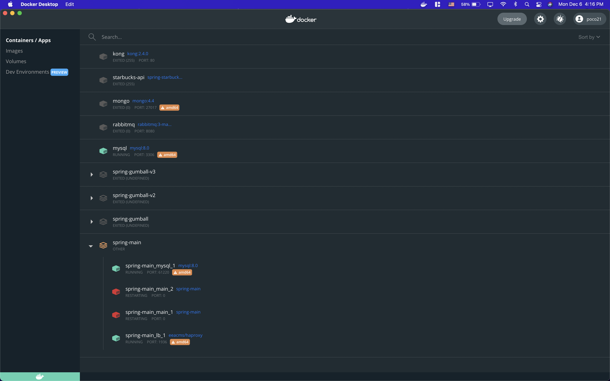

# Suyeob's Journal

## 11/29/21 
* First edited the spring-customer section for billingInfo, cardInfo, and customer. 

## 12/1/21 
* Started edited the spring-manga.   
  

* I decided that spring-manga needs to implemented with Order part. 
	* For ordering, I will develop items and shopping cart. 
	* For items, I will insert the data in MySQL which includes isbn, and manga title.

## 12/2/21
* Added MangaOrder class for add items to shopping cart. 
* Added repositories for MangaOrder, CartItem, and ShoppingCart classes. 
* Added MangaOrderController class for odering process.

## 12/3/21 
* Added manga images and add .sql file. 
* SQL file includes isbn, title, description, author, price and stock.

## 12/4/21
* Failed on build spring-manga, kept modifying the code.
* Had trouble on implementing the MangaOrderController. 

## 12/5/21 
* Our group decided to create a monolithic application instead of using a microservices API due to time constraints and lack of function capabilities.
* Update the Manga Model, Controller, Repositories on spring-main. 
* Tried to build MangaOrderController to access catalog and shopping cart.

## 12/6/21 
* Failed on docker build, spring-main kept restarting.  
  

